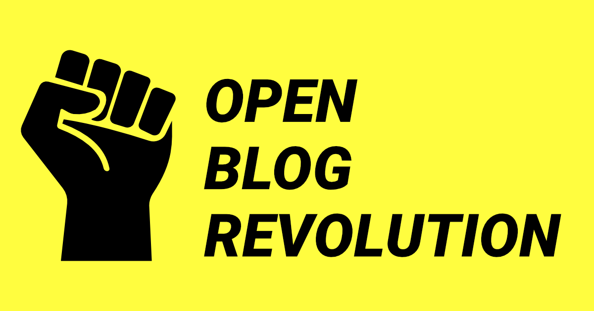

# Open Blog Revolution (OBR)

HTML first blog template for writers and devs.



[](https://app.netlify.com/start/deploy?repository=https://github.com/the-coded-type/open-blog-revolution)

## Features

* **Built with Astro 5:** Blazing fast performance and modern architecture.
* **Pages CMS Compatible:** User-friendly, Git-based CMS for editing content (No database required!).
* **Resilient Web Desing:** Built with Resiliient Web Design principles in mind for better accessibility.
* **Optimized Images:** Automatic image optimization (WebP/AVIF generation) using Astro Assets.
* **SEO Ready:** Includes Open Graph tags, Sitemap generation.
* **Responsive:** Mobile-first design, designed for any device.
* **Tagging and Archive System:** Organize posts by tags with dedicated tags and archive pages.
* **RSS** RSS Feed included.
* **Zero JavaScript Runtime:** (Mostly) static HTML for maximum speed.

## What is this?

A free template for building self-hosted blogs.

It's built with [Astro](https://astro.build/).

It's designed by IKO, web developper, and game designer, blogger at [The Coded Type](https://thecodedtype.com/).

You can see a preview [here](https://open-blog-revolution.netlify.app/).

## Philosphy

OBR is an HTML-first blog template. It adheres to the principles of [Resilient Web Design](https://resilientwebdesign.com/) and aims at delivering fast and accessible websites. It uses a **Static Site Generator (SSG)** to build static HTML (Javascript free) pages from the blog content. It uses a file-based system as a database, which makes it easy to host on GitHub or build locally.

## Who is it for?

* Writers who look for a simple solution to build self-hosted blogs.
* Developers who look for a starter template to expand on.

## Self-hosting?

Any OBR blog can be hosted anywhere. This document provides instructions to install it on the free [Netlify](https://www.netlify.com/) tier. 

## License

Released under the [MIT License](./LICENSE)

## Deploy on Netlify
Just click the button:

[](https://app.netlify.com/start/deploy?repository=https://github.com/the-coded-type/open-blog-revolution)

OR:
* Fork this repository (fork button on the top right corner). GitHub will create a copy of that entire project under your username. You might need to create a GitHub account.

* Create a free account on [Netlify](https://www.netlify.com/). You can log in with your GitHub credentials.

* On Netlify, go to **Projects** select **Add new project / Import an existing project.**

* Click on the **GitHub** icon. Select your newly created repository.

* Every time you modify the blog or its contents, Netlify will automatically update the website.

## Deploy on GitHub Pages

* On your repository page click on **⚙️ Settings** 

* Head to **Pages**

* **In Build and Deployement** select as `source` `GitHub Actions`

* You blog deploys at https://<user-name>.github.io/<repo-name>

* Check the status of your deployment in your repo page under **Actions**

## How to start Blogging

⚠️ Now that your blog is installed you need to setup a backend that will allow you to write and publish blogs.

### Writer friendly backend

You can use Pages CMS a free and simple backend.

* Open a free account on [Pages CMS](https://pagescms.org/)
* Add your OBR GitHub repository as a Project.
* Open it.
* Edit the **Blog Connfig**
* Add Posts and Pages

### If you're comfortable with using markdown and GitHub

You can edit and create posts in the GitHub repo directly.

* You can add posts as `.mdx `files in the `/src/content/posts` folder
* You can add pages as `.mdx `files in the `/src/pages` folder
* Media (images) must be located in `/src/content/media`
* Edit `/blog-config.yaml` to configure your blog.

Partial project structure:

```text
/
├── public/
├── src/
│   └── pages/
│   └── content/
│       └── posts/
│       └── media/
└── blog-config.yaml
```
New posts must have the following **frontmatter**

```yaml
---
title: Post title
description: Post description
pubDate: yyyy-mm-dd
status: published | draft
author: Author name
tags:
  - tag
cover:
  src: relative path, for example ../media/imagename
  title: string
  alt: string
---
```
Posts must have at least one tag.

`.mdx` is similar to Markdown but allows you to use HTML tags.

## Contributing Policy
**Feature requests**
Submit and upvote feature requests https://github.com/the-coded-type/open-blog-revolution/discussions/2

**If you found a bug:**
Please open an issue to report it.

**Pull requests:**
You're free to submit a pull request. However, I can't guarantee I'll be accepting them right now, as the project is still being defined.

**Copy**
You're free to fork/copy the repository according to the [license](./LICENSE).

## Credits and aknowledgments

Built with [ASTRO](https://astro.build/)

Fist logo Created by BnB Studio from [Noun Project](https://thenounproject.com/)

CSS utils inspired by [Kelp UI](https://kelpui.com/) and [Tailwind](https://kelpui.com/)

Resilient Web principles learned from [Jeremy Keith](https://resilientwebdesign.com/)